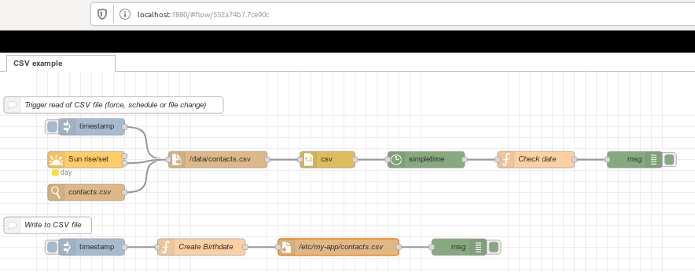

= Summary

This is an example of writing reading in CSV file serving as a Birth Database.

This flow shows how to:
- add to CSV file
- check dates daily and eventually trigger a message which may be hooked to notification such as WhatsApp or Telegram. 

= Snapshot

= Environment

[source,bash]
----
$ docker-compose up -d
$ docker-compose down
----

