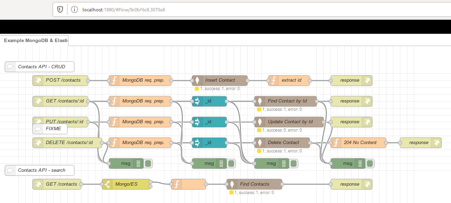

= Summary

This is an example of creating a microservice.

Here this is a simple Contact storage API, storing in MongoDB.

= Snapshot

= Environment

Volume is created for database.

As usual:

[source,bash]
----
$ docker-compose up -d
$ docker-compose down
----

= API

== Create contact

[source,bash]
----
$ curl -v -X POST -H "Content-Type: application/json" -d '{ "FirstName": "FNTest", "LastName": "LNTest" }' http://localhost:2880/contacts
----

== Find Contacts

[source,bash]
----
$ curl -v -X GET http://localhost:2880/contacts?FirstName=FNTest
----

== Update Contacts

[source,bash]
----
$ curl -v -X PUT -H "Content-Type: application/json" -d '{ "_id": "123154", "FirstName": "FNTest", "LastName": "LNTest" }' http://localhost:2880/contacts
----

== Delete Contacts

[source,bash]
----
$ curl -v -X DELETE http://localhost:2880/contacts/1234564
----