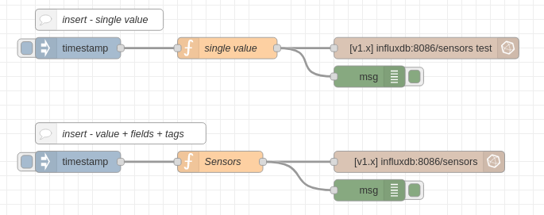

= node-red-contrib-influxdb

This is a sample of using node-red-contrib-influxdb to push and graph time metrics.

== Environment

Edit a *.env* file based on *.env-example* and setup your credentials.

Build the few dependencies:

    $ docker-compose build

Start the flow:

    $ docker-compose up -d

Stop everything:

    $ docker-compose stop

Cleanup everything (including database):

    $ docker-compose down -v

== Troubleshoot

Here are few command to troubleshoot InfluxDB.

=== Enter InfluxDB

.As CLI
[source,bash]
----
# Enter docker container
$ docker exec -it basics-node-red-contrib-influxdb_influxdb_1 bash
# Run Influx CLI
root@bb69221ac8fe:/# influx -precision rfc3339
Visit https://enterprise.influxdata.com to register for updates, InfluxDB server management, and monitoring.
Connected to http://localhost:8086 version 0.9.6.1
InfluxDB shell 0.9.6.1
> create database SensorData;
...
> show databases;
name: databases
---------------
name
SensorData
telegraf
> 
----

.As curl
[source,bash]
----
$ curl -G http://localhost:8086/query --data-urlencode "q=SHOW DATABASES"
{"results":[{"statement_id":0,"series":[{"name":"databases","columns":["name"],"values":[["telegraf"],["SensorData"]]}]}]}
----

=== Inserting / Selecting

[source,bash]
----
root@6796120cd3fa:/# influx -precision rfc3339
Connected to http://localhost:8086 version 1.8.3
InfluxDB shell version: 1.8.3
> show databases
name: databases
name
sensors

> use sensors
Using database sensors

> INSERT sensors,location=office,type=temp value=25
> INSERT sensors,location=office,type=temp value=23
> INSERT sensors,location=office,type=temp value=22

> \select * from sensors
name: sensors
time                           location type value
----                           -------- ---- -----
2021-01-02T17:30:30.173554863Z office   temp 25
2021-01-02T17:30:52.262007663Z office   temp 23
2021-01-02T17:30:56.682454825Z office   temp 22

# Select first (oldest)
> SELECT * FROM /.*/ LIMIT 1
name: sensors
time                           location type value
----                           -------- ---- -----
2021-01-02T17:30:30.173554863Z office   temp 25

# Select with filter
> SELECT * FROM "sensors" WHERE "value" > 22

name: sensors
time                           location type value
----                           -------- ---- -----
2021-01-02T17:30:30.173554863Z office   temp 25
2021-01-02T17:30:52.262007663Z office   temp 23
----

=== Retention policies

See: link:https://docs.influxdata.com/influxdb/v1.8/query_language/manage-database/[InfluxDB doc database retention]

Default Schema is created with:
- *DEFAULT retention* is only 1 hour, 
- longer retention of 4 weeks is used after *downsampling* the data using a *continuous query*

[source,bash]
----
CREATE DATABASE sensors;
CREATE RETENTION POLICY one_hour ON sensors DURATION 1h REPLICATION 1 DEFAULT;
CREATE RETENTION POLICY one_month ON sensors DURATION 4w REPLICATION 1;
CREATE CONTINUOUS QUERY "cq_15m" ON sensors BEGIN
  SELECT mean("value") AS "mean_temp"
  INTO "one_month"."downsampled_sensors"
  FROM "sensors"
  GROUP BY time(15m)
END
----

Node-Red default flow does plenty inserts continuously.

Let this run for at least 15min to see the effect of *downsampling*, then run below commands:

[source,bash]
----
# DEFAULT retention queries
> use sensors
> SELECT * FROM /.*/ LIMIT 4
name: sensors
time                           location type value
----                           -------- ---- -----
2021-01-03T12:47:31.891410765Z office   temp 21.40042538145746
2021-01-03T12:47:32.865554076Z office   temp 19.02397972203253
2021-01-03T12:47:33.86622876Z  office   temp 22.583780191258768
2021-01-03T12:47:34.866118246Z office   temp 22.604425205798144

# 15min have past => new measurement is visible due to CQ
> show measurements
name: measurements
name
-----
downsampled_sensors
sensors

> SELECT * FROM "one_month"."downsampled_sensors" LIMIT 5
name: downsampled_sensors
time                 mean_temp
----                 ---------
2021-01-03T12:45:00Z 20.795088968018142
----

== Resources

* InfluxDB 1.x
** link:https://docs.influxdata.com/influxdb/v1.8/[InfluxDB docs]
** link:https://docs.influxdata.com/influxdb/v1.8/introduction/getting_started/[InfluxDB doc getting started]
** link:https://www.influxdata.com/blog/data-layout-and-schema-design-best-practices-for-influxdb/[InfluxDB schema design]
** link:https://docs.influxdata.com/influxdb/v1.8/query_language/manage-database/[InfluxDB doc database retention]
** link:https://devconnected.com/the-definitive-guide-to-influxdb-in-2019/[InfluxDB learning]
** link:https://flows.nodered.org/node/node-red-contrib-influxdb[Node-Red InfluxDB]
** link:https://hub.docker.com/_/influxdb[Docker image]

* InfluxDB 2.0 ?
** link:https://docs.influxdata.com/influxdb/v2.0/get-started/[InfluxDB 2.0]
** link:https://dzone.com/articles/getting-started-with-influxdb-20#[Getting started]