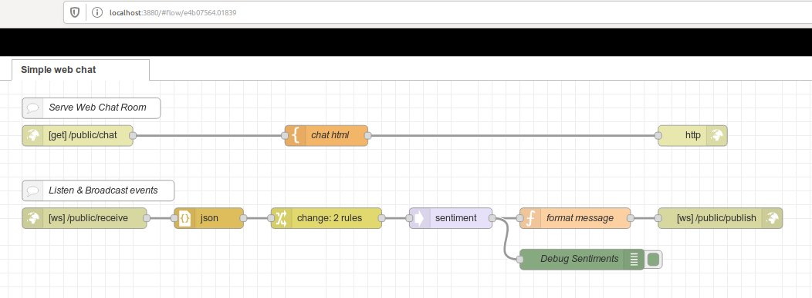
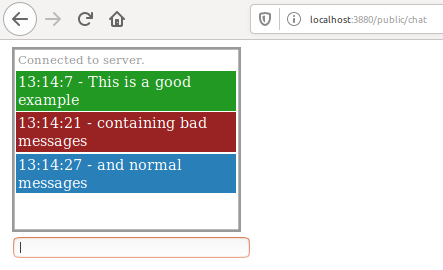

# What is this example?

This is a sample chat flow from FRED online hosted Node-RED.

# Flow

# User experience

# How-To

Build the few dependencies:

    $ docker-compose build

Start the flow:

    $ docker-compose start

Connect some users to chat room by browsing to link:http://localhost:3880/public/chat[] from multiple browsers

Chat messages with keywords *good*, *bad*, etc

Stop everything:

    $ docker-compose down