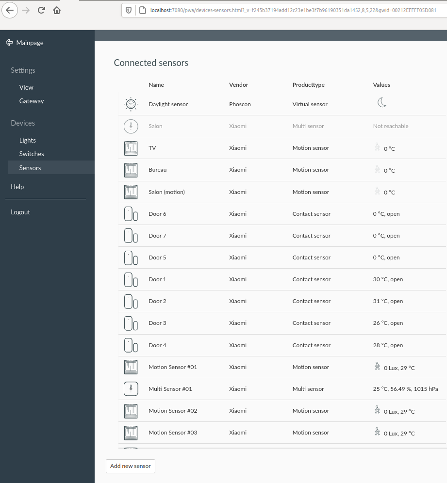

= What is this example?

This is a sample of using link:https://phoscon.de/en/conbee2/[Zigbee USB key] with sensor devices (e.g. Xiaomi).

image:screenshot-zigbee-nodered[]

= Pre-requisits

You need to understand Zigbee basics. +
And make sure the USB stick and devices are correctly paired. +
Check low-level info at link:https://github.com/kalemena/iot-tools/tree/master/docs/gateways/zigbee[]

= How-To

[IMPORTANT]
====
Zigbee libraries are setup in side-car docker container named *deconz*. +
Follow instruction at link above to pair devices and generate the deconz configs under folder *deconz*
====

Here is how to run the ZWave in Node-RED:

* Edit *docker-compose.yml* to set you USB Zigbee key (e.g. /dev/ttyZigbee)
* Start environment as explained below
* Browse link:http://localhost:1880[] & link:http://localhost:7080[]
* Open one of the Zigbee node, and edit Configuration to setup Deconz properly:
** Grab IP address of deconz, ports are 7080 and 7443 for websocket
** In Deconz UI, enter pairing mode (see pre-requisits)
** In Node-red, click magic button to get an APIKey
** Apply => nodes should eventually get green
* Wait for sensor events, or switch a button if you paired Zigbee buttons 

## Environment

Build the few dependencies:

    $ docker-compose build

Start the flow:

    $ docker-compose up -d

Stop everything:

    $ docker-compose stop

Cleanup everything (including database):

    $ docker-compose down -v

curl -X POST -u "apikey:XZZIkU2kjI-Laow6RSWE_Pi3rN5A3i2KnXVMv9IDzGaJ" --header "Content-Type: application/json" --data "{\"text\": [\"Bonjour monsieur le conseiller! \"], \"model_id\":\"fr-en\"}" "https://gateway-lon.watsonplatform.net/language-translator/api/v3/translate?version=2018-05-01"