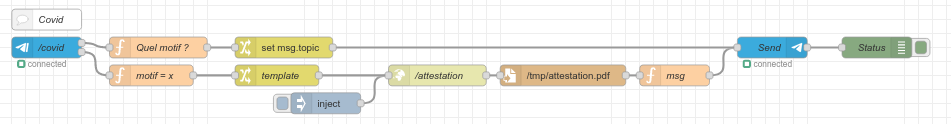
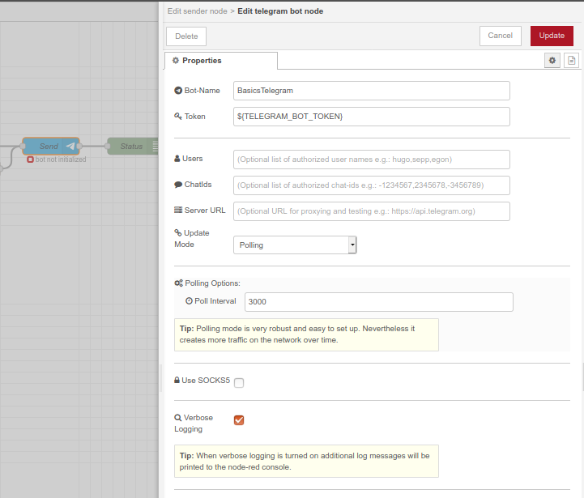
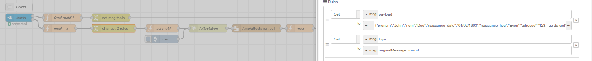
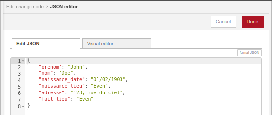

= Telegram Bot - Attestation COVID 19

Cette exemple démontre la création d'un Chat Bot permettant de demander une attestation COVID 19 de déplacement pour la France.

IMPORTANT: ce projet fait appel au code de création d'attestation PDF: link:https://github.com/kalemena/attestation-covid19[]

.Exemple de Chat

== Comment faire?

Il faut:

* link:https://core.telegram.org/bots#creating-a-new-bot[Créer un Telegram Bot]
* Editer le fichier *.env* et positioner la valeur précédement générée pour *TELEGRAM_BOT_TOKEN*
* Construire l'environement

    $ docker-compose build

* Démarrer l'environment

    $ docker-compose up -d

* Ouvrir un navigateur sur link:http://localhost:2880[]

* Ouvrir un des noeuds Telegram (en bleu) et éditer la configuration pour positioner API TOKEN à *${TELEGRAM_BOT_TOKEN}* (ou le vrai token). +
Positioner les filtres sur les autorisations au passage si besoin.

* Ouvrir le noeud *template* pour configurer vos détails d'adresse

* Cliquer *Deploy*. Normalement les noeuds Telegram doivent afficher une note verte *"connected"*

* Commencer une conversation depuis un client Telegram vers votre Telegram Bot

* Demander */covid*. Le Bot répond par une question *Quel motif?*

* Répondre un des choix proposés. L'attestation arrivera sous peu en PDF.

== Adapter cet exemple

TIP: Vous pouvez maintenant adpater cette exemple !

* ajouter des noeuds *Inject* pour automatiser la création d'attestation à des heures précises. + 
Par exemple à l'heure habituelle de votre sport !

* ajouter des utilisateurs

== Environment

Construire l'environement:

    $ docker-compose build

Démarrer l'environement:

    $ docker-compose up -d

Stoper l'environement:

    $ docker-compose stop

Nettoyer l'environement:

    $ docker-compose down -v

