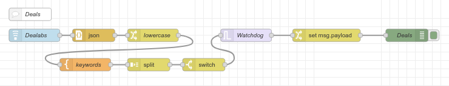

= node-red-contrib-feedparser

This is a sample of listening on RSS feed using node-red-contrib-feedparser.

Here we listen on Dealabs, parse feed for keywords and eventually log matching deals.

This works very good if replacing message by Telegram notice.

== Environment

Build the few dependencies:

    $ docker-compose build

Start the flow:

    $ docker-compose up -d

Stop everything:

    $ docker-compose stop

Cleanup everything (including database):

    $ docker-compose down -v

== Resources

For the example, the RSS feed links used can be:

* All streams:
** https://www.dealabs.com/rss[Tous les deals]
** https://www.dealabs.com/rss/hot[Uniquement les deals Hot]
** https://www.dealabs.com/rss/bons-plans[Uniquement les bons plans]
** https://www.dealabs.com/rss/codes-promo[Uniquement les codes promo]

* Streams by category:
** https://www.dealabs.com/rss/groupe/informatique[Catégorie informatique]
** https://www.dealabs.com/rss/groupe/telephonie[Catégorie téléphonie]
** https://www.dealabs.com/rss/groupe/consoles-jeux-video[Catégorie jeux-vidéo]
** https://www.dealabs.com/rss/groupe/accessoires-gadgets[Catégorie gadgets]
** https://www.dealabs.com/rss/groupe/applis-logiciels[Catégorie logiciels]
** https://www.dealabs.com/rss/groupe/image-son-video[Catégorie image/son]
** https://www.dealabs.com/rss/groupe/jeux-jouets[Catégorie jouets]
** https://www.dealabs.com/rss/groupe/culture-divertissement[Catégorie culture]
** https://www.dealabs.com/rss/groupe/sports-plein-air[Catégorie sports]
** https://www.dealabs.com/rss/groupe/animaux[Catégorie animaux]
** https://www.dealabs.com/rss/groupe/mode-accessoires[Catégorie mode]
** https://www.dealabs.com/rss/groupe/hygiene-sante-cosmetiques[Catégorie santé]
** https://www.dealabs.com/rss/groupe/maison-jardin[Catégorie maison]
** https://www.dealabs.com/rss/groupe/voyages-sorties-restaurants[Catégorie voyages]
** https://www.dealabs.com/rss/groupe/alimentation-boissons[Catégorie alimentation]
** https://www.dealabs.com/rss/groupe/services-divers[Catégorie services]