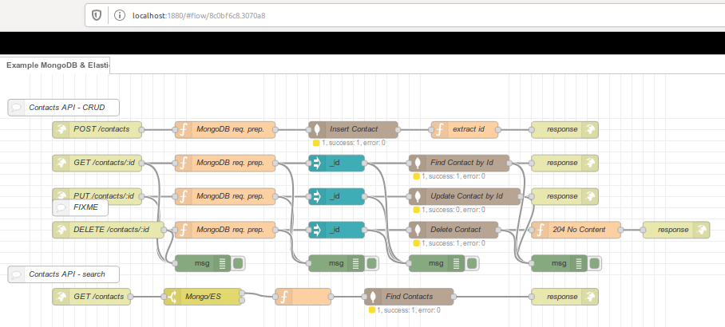

= Summary

This is an example of creating a microservice.

Here this is a simple Contact storage API, storing in MongoDB.

= Snapshot

= Environment

Volume is created for database.

As usual:

[source,bash]
----
$ docker-compose up -d
$ docker-compose down
----

= API

== Create contact

    $ curl -X POST -H "Content-Type: application/json" -d '{ "FirstName": "Maurice", "LastName": "Toomuch" }' http://localhost:1880/contacts | jq .
    {
        "_id": "5dd1685e71acf6000691a6df"
    }

== Get contact by Id

    $ curl -X GET http://localhost:1880/contacts/5dd1685e71acf6000691a6df | jq .
    [
        {
            "_id": "5dd1685e71acf6000691a6df",
            "FirstName": "Maurice",
            "LastName": "Toomuch"
        }
    ]

== Delete contact by Id

    $ curl -X DELETE http://localhost:1880/contacts/5dd1685e71acf6000691a6df | jq .
    {}

== Update Contact by Id

FIXME

    $ curl -X PUT -H "Content-Type: application/json" -d '{ "_id": "123154", "FirstName": "FNTest", "LastName": "LNTest" }' http://localhost:1880/contacts

== Find Contacts

FIXME: this seems to work for single key, but not multiple

    $ curl -X GET http://localhost:1880/contacts?FirstName=Maurice | jq .
    [
        {
            "_id": "5dd1685e71acf6000691a6df",
            "FirstName": "Maurice",
            "LastName": "Toomuch"
        }
    ]