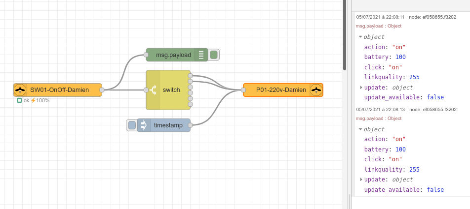

= What is this example?
:hardbreaks:

This example shows a basic usage of Node-RED Zigbee 2 MQTT.

== Flow

=== How-To

==== Environment

Build the few dependencies:

    $ docker-compose build

Start the flow:

    $ docker-compose up -d

Stop everything:

    $ docker-compose stop

Cleanup everything (including database):

    $ docker-compose down -v
