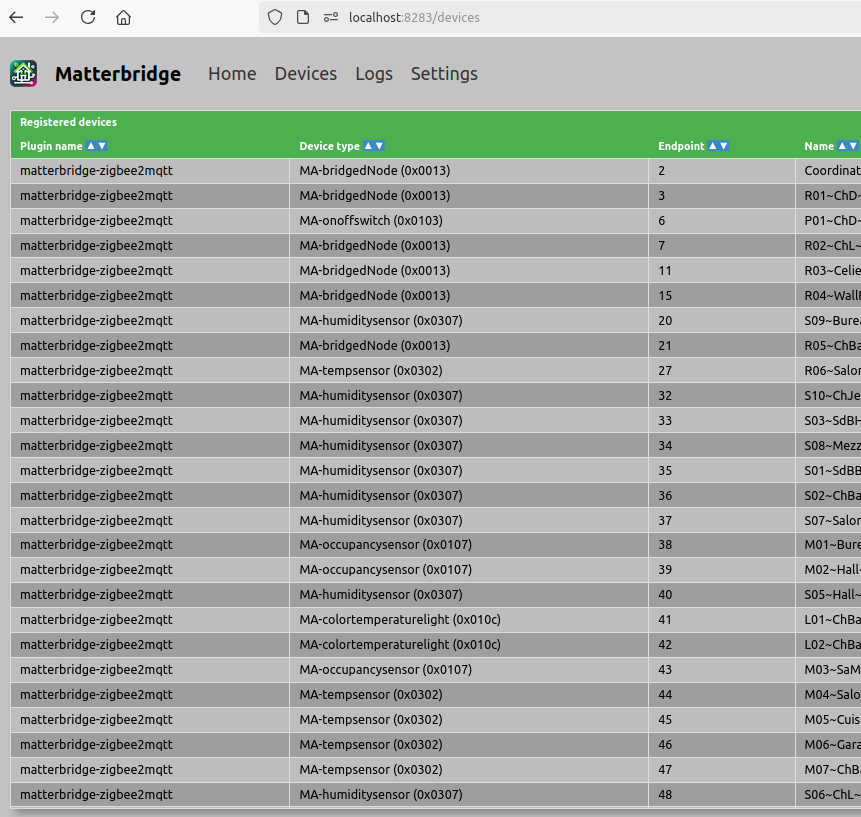

= What is this example?
:hardbreaks:

This example shows a basic usage of Node-RED Matter.

.Sample Flow - standalone
image:node-red-matter.png[]

.Sample Bridge Web App - display zigbee devices

== Links

* link:https://project-chip.github.io/connectedhomeip-doc/index.html[Matter @ project-chip]
* link:https://mattercoder.com/[Matter Coder]
* link:https://canonical-matter.readthedocs-hosted.com/_/downloads/en/latest/pdf/[PDF - Ubuntu setup tutorial guide]

* link:https://github.com/Luligu/matterbridge[Matter Bridge]

== How-To

=== Environment

Build the few dependencies:

    $ docker-compose build

Start the flow:

    $ docker-compose up -d

Stop everything:

    $ docker-compose stop

Cleanup everything (including database):

    $ docker-compose down -v

=== Matterbridge

IMPORTANT: Below assumes zigbee2mqtt is installed, and that mqtt is setup on localhost:1883

NOTE: Matterbridge configuration file is mounted with matterbridge container

* Browse to link:http://localhost:8283[] to open UI
* Install and register plugins, in this case matterbridge-zigbee2mqtt
* Switch to device list

.Sample Bridge Web App - display zigbee devices
