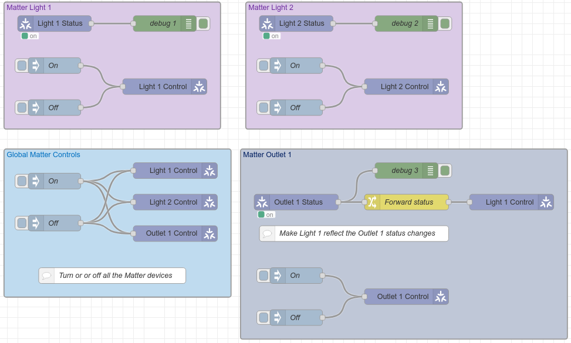

= What is this example?
:hardbreaks:

This example shows a basic usage of Node-RED Matter.

== Links

* link:https://project-chip.github.io/connectedhomeip-doc/index.html[Matter @ project-chip]
* link:https://mattercoder.com/[Matter Coder]
* link:https://canonical-matter.readthedocs-hosted.com/_/downloads/en/latest/pdf/[PDF - Ubuntu setup tutorial guide]

== Flow

=== How-To

==== Environment

Build the few dependencies:

    $ docker-compose build

Start the flow:

    $ docker-compose up -d

Stop everything:

    $ docker-compose stop

Cleanup everything (including database):

    $ docker-compose down -v
