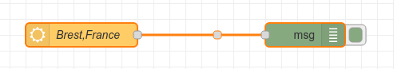

= Summary

This is an example of using openweathermap node (aka node-red-node-openweathermap) as hello world.

== Snapshot

== Environment

As usual:

[source,bash]
----
$ docker-compose up -d
$ docker-compose down
----

== Example output

[source,bash]
----
payload: object
    id: 803
    weather: "Clouds"
    detail: "nuageux"
    icon: "04n"
    tempk: 284.11
    tempc: 10.9
    temp_maxc: 11.1
    temp_minc: 9.2
    humidity: 79
    pressure: 995
    maxtemp: 284.33
    mintemp: 282.42
    windspeed: 8.23
    winddirection: 230
location: "Brest"
sunrise: 2022-11-15T07:25:21.000Z
sunset: 2022-11-15T16:39:53.000Z
clouds: 75
description: "The weather in Brest at coordinates: 48.4, -4.4833 is Clouds (nuageux)."
location: object
data: object
    coord: object
        weather: array[1]
        0: object
        id: 803
        main: "Clouds"
        description: "nuageux"
        icon: "04n"
    base: "stations"
    main: object
        temp: 284.11
        feels_like: 283.32
        temp_min: 282.42
        temp_max: 284.33
        pressure: 995
        humidity: 79
    visibility: 10000
    wind: object
        speed: 8.23
        deg: 230
    clouds: object
        all: 75
    dt: 1668543784
    sys: object
        type: 1
        id: 6554
        country: "FR"
        sunrise: 15/11/2022 08:25:21 [UTC+1]
        sunset: 15/11/2022 17:39:53 [UTC+1]
    timezone: 3600
    id: 3030300
    name: "Brest"
    cod: 200
time: "2022-11-15T20:23:04.000Z"
title: "Current Weather Information"
description: "Current weather information at coordinates: 48.4, -4.4833"
----