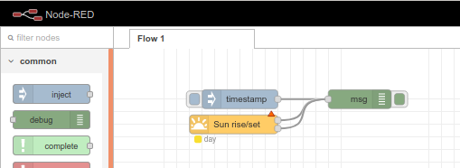

= Summary

This is an example of using sunrise/sunset node (aka node-red-node-suncalc) as hello world.

== Snapshot

== Environment

As usual:

[source,bash]
----
$ docker-compose up -d
$ docker-compose down
----

