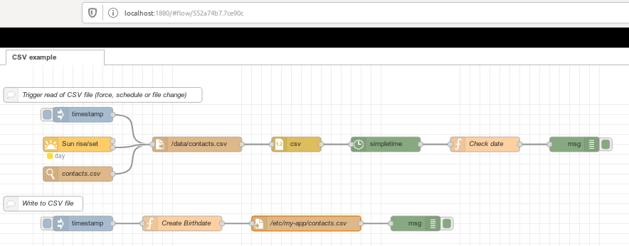
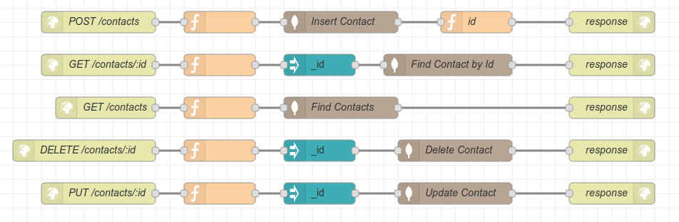
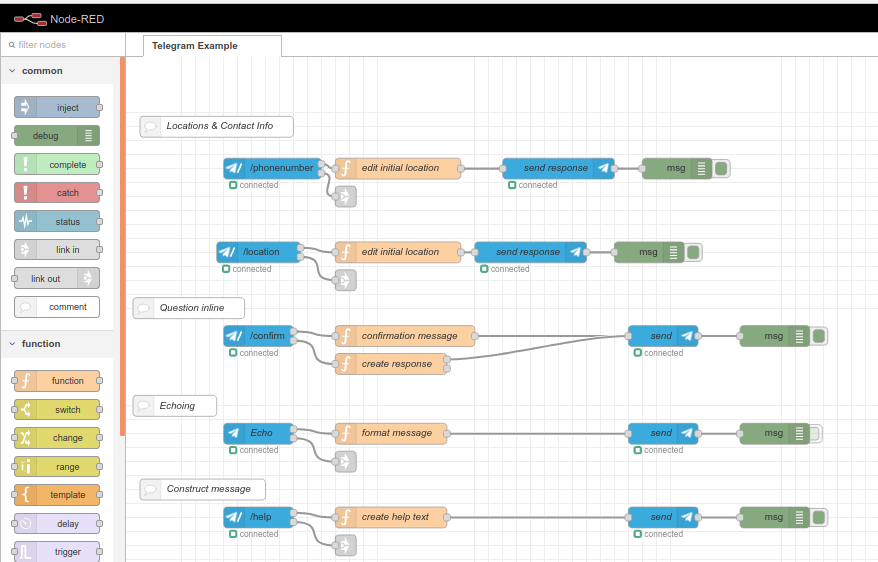
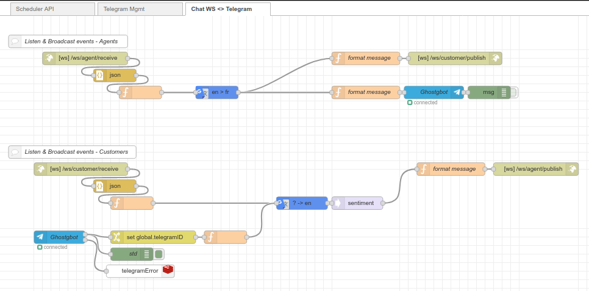
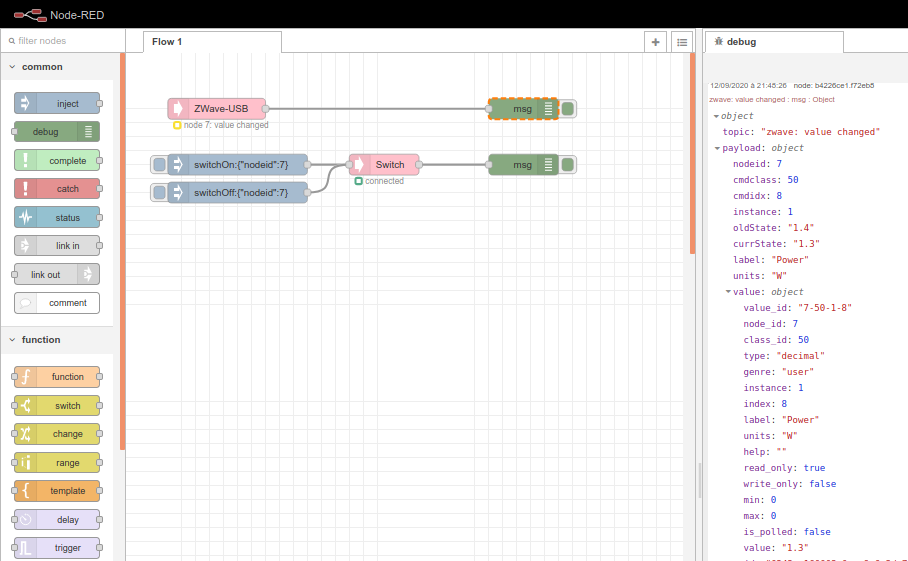
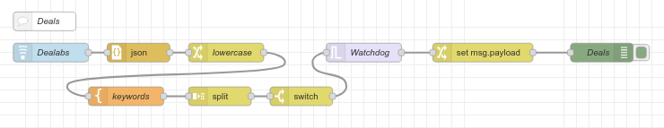

= Examples

Hera are few other examples from this reporsitory:

== Simple flows

.CSV file read

// .HTTP API & ElasticSearch storage for contact creation/identification
// image:basics-elasticsearch-http-contacts-api/contacts-api.png[link="basics-elasticsearch-http-contacts-api"]

.Sunrise/Sunset node
image:sunrise.png[link="basics-hello", 640,320]

.HTTP API & MongoDB storage for contact creation/identification

.HTTP API & Redis storage for a scheduler API
image:basics-redis-http-scheduler-api/redis-http-scheduler-api.png[link="basics-redis-http-scheduler-api", 640,320]

.Telegram usage

// .Using WebSockets in Chat Room - example from FRED portal
// image:basics-websockets-chat-sentiment[link="basics-websockets-chat-sentiment"]

.Advanced flows - websocket + telegram + redis

.ZigBee devices 
image:gateways-zigbee/screenshot-zigbee-nodered.png[link="gateways-zigbee", 640,320]

.ZWave devices

.node-red-node-feedparser

== Other example based on my contribs

- link:https://github.com/kalemena/node-red-contrib-libphonenumber[LibPhoneNumber example]

== Monitoring

- link:https://developer.ibm.com/node/2017/07/26/visualize-node-red-flow-performance-using-node-application-metrics/[Plug Monitoring]
